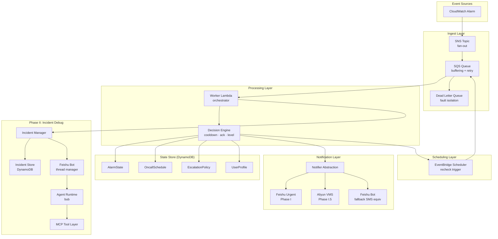
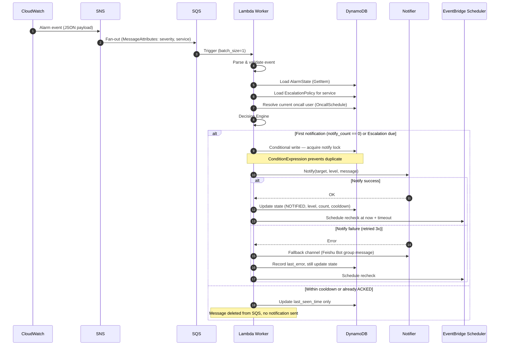
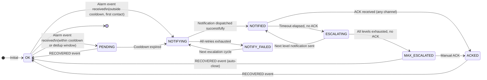
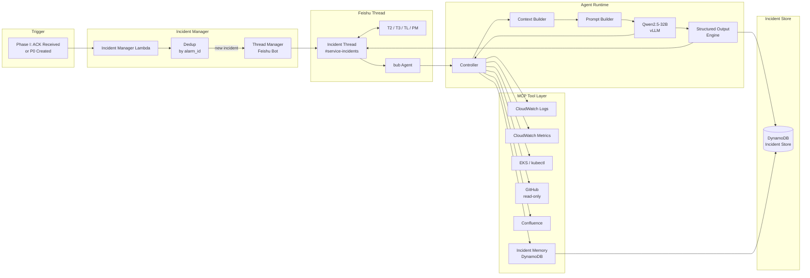

# Automated On-Call & Incident Debug Platform — Technical Specification

**Version**: 1.0-draft  
**Author**: Architecture Review  
**Status**: For Proposal Review  
**Scope**: AWS China Region

---

## Table of Contents

1. [Problem Statement](#1-problem-statement)
2. [Goals & Non-Goals](#2-goals--non-goals)
3. [System Overview & Phase Roadmap](#3-system-overview--phase-roadmap)
4. [Phase I — Automated On-Call Notification](#4-phase-i--automated-on-call-notification)
   - 4.1 Architecture
   - 4.2 Component Design
   - 4.3 Notification Channel Strategy
   - 4.4 State Machine
   - 4.5 DynamoDB Single-Table Design
   - 4.6 Decision Engine
   - 4.7 Escalation & Time-Driven Scheduling
   - 4.8 ACK Mechanism
   - 4.9 Idempotency
   - 4.10 Reliability & Failure Handling
   - 4.11 Observability
5. [Phase II — Collaborative Incident Debug (Human + Agent)](#5-phase-ii--collaborative-incident-debug)
   - 5.1 Architecture
   - 5.2 Agent Runtime Design
   - 5.3 MCP Tool Layer
   - 5.4 DynamoDB Schema (Incident Store)
   - 5.5 Knowledge System
6. [Phase III — Full Automation Horizon](#6-phase-iii--full-automation-horizon)
7. [Cross-Cutting Concerns](#7-cross-cutting-concerns)
8. [Implementation Difficulty Assessment](#8-implementation-difficulty-assessment)
9. [Open Questions & Risks](#9-open-questions--risks)

---

## 1. Problem Statement

AWS China does not provide native voice notification capabilities. Production P0/P1 incidents require **strong-reach** notifications — email and SNS-based push alone are insufficient for guaranteed human response within SLA windows.

Beyond first-touch notification, incident response involves multiple engineers (T2/T3/TL/PM) collaborating in real-time with fragmented tools: manually querying CloudWatch, digging through EKS pod logs, pinging teammates over IM. This friction directly increases MTTR.

This spec defines a two-phase platform that:

1. **Phase I**: Replaces manual paging with an automated, escalating on-call notification chain (T1 → T2 → T3), with voice call as the primary channel.
2. **Phase II**: Augments human collaborative debug with an AI agent (bub) that operates as a peer inside the incident thread, gathering data, surfacing root cause hypotheses, and maintaining a live structured summary.

---

## 2. Goals & Non-Goals

### Goals

| ID | Goal | Metric |
|----|------|--------|
| G1 | Zero alarm loss — at-least-once delivery | DLQ depth = 0 under normal load |
| G2 | Strong-reach first notification — voice/phone call as primary channel | Voice attempt rate ≥ 99% for P0/P1 |
| G3 | Anti-spam — dedup + cooldown + ACK stops escalation | Duplicate notify rate < 1% |
| G4 | Time-driven escalation — T1 → T2 → T3 if no ACK | Escalation success rate ≥ 99.5% |
| G5 | Structured incident data — every incident persists a queryable record | 100% incident coverage |
| G6 | Agent-augmented debug — bub reduces manual query time by ≥ 50% | MTTR reduction measured per team |
| G7 | Full audit trail — all actions (human + agent + tool) are traceable | 0 unattributed events |

### Non-Goals (MVP)

- Full web UI console (text-based interface via Feishu/Slack is sufficient for MVP)
- Auto-remediation / self-healing (Phase III horizon)
- Complex shift scheduling with rotation rules (basic schedule table is sufficient for Phase I)
- Multi-region active-active (single-region primary with DLQ-based recovery)

---

## 3. System Overview & Phase Roadmap

### 3.1 Phase Map

```
Phase I     ─── Automated OnCall Notification (Voice/IM)
  │              CloudWatch → SNS → SQS → Lambda → Feishu Urgent / VMS
  │              State Machine + Escalation + ACK
  │
Phase I.5   ─── VMS Integration (pending enterprise cert)
  │              Drop-in swap of Feishu Urgent → Aliyun VMS
  │
Phase II    ─── Agent-Augmented Collaborative Debug
  │              Incident Thread (Feishu) + bub Agent + MCP Tools
  │              DynamoDB Incident Store + Knowledge Sink
  │
Phase III   ─── Automation Horizon
               Runbook-driven auto-remediation + proactive anomaly detection
```

### 3.2 High-Level Architecture



---

## 4. Phase I — Automated On-Call Notification

### 4.1 Architecture



### 4.2 Component Design

#### 4.2.1 SNS (Event Entry Point)

**Role**: Pure fan-out. No business logic.

**Configuration**:
```json
{
  "Type": "Standard",
  "MessageRetentionPeriod": 3600,
  "MessageAttributes": {
    "severity": {"DataType": "String"},
    "service": {"DataType": "String"},
    "region": {"DataType": "String"}
  }
}
```

**Message Schema** (enforced, producers must conform):
```json
{
  "alarm_id": "cpu-high-api-prod",
  "alarm_name": "CPUUtilization > 90%",
  "service": "api-service",
  "severity": "P0",
  "state": "ALARM",
  "previous_state": "OK",
  "timestamp": 1710000000,
  "region": "cn-northwest-1",
  "details": {
    "metric": "CPUUtilization",
    "threshold": 90,
    "actual": 97.3,
    "namespace": "AWS/EC2"
  }
}
```

**Critical rules**:
- SNS does **zero** filtering or routing — that's the Decision Engine's job
- All consumers subscribe to a single topic per environment (prod/staging)
- Message deduplication is NOT at SNS layer — it's at DynamoDB state layer

#### 4.2.2 SQS (Reliability Buffer)

**Role**: At-least-once delivery, storm buffering, retry backoff.

| Parameter | Value | Rationale |
|-----------|-------|-----------|
| Type | Standard | At-least-once sufficient; ordering handled by state machine |
| Visibility Timeout | 90s | Lambda timeout (30s) × 3 with safety margin |
| Long Polling | 20s | Reduce empty receives |
| Message Retention | 4 days | Recovery window for DLQ triage |
| DLQ maxReceiveCount | 5 | 5 failed attempts before parking |

**Recheck messages** (from EventBridge via SQS): Use a separate `recheck` SQS queue or use `MessageAttributes.source=recheck` to distinguish. The Decision Engine treats recheck events as escalation-check triggers rather than new alarm events.

> ⚠️ **SQS delay queue max is 15 minutes.** For escalation timeouts > 15 min, use EventBridge Scheduler directly (see §4.7). Do not use SQS delay queue for escalation scheduling.

#### 4.2.3 Lambda (Orchestrator)

**Configuration**:
```
Runtime:          Python 3.12
Timeout:          30s
Memory:           256 MB
Reserved Concurrency: 10  (prevent thundering herd on alarm storms)
Batch Size:       1        (one message = one atomic state transition)
```

**Critical design rules**:
- Lambda is **stateless** — all state lives in DynamoDB
- Every handler is idempotent (see §4.9)
- Lambda does NOT do exponential backoff on DynamoDB ConditionExpression failures — it throws and lets SQS handle retry
- Lambda errors that cannot be retried (e.g., schema parse failures) are sent to DLQ immediately via `batchItemFailures` response

**Handler skeleton**:
```python
def handler(event, context):
    for record in event['Records']:
        try:
            process_record(record)
        except NonRetryableError as e:
            # Schema error, poison pill — send to DLQ
            batch_failures.append(record['messageId'])
        except RetryableError as e:
            # Transient — let SQS retry
            raise

def process_record(record):
    msg = parse_and_validate(record['body'])  # raises NonRetryableError on bad schema
    state = load_alarm_state(msg.alarm_id)    # raises RetryableError on DDB timeout
    policy = load_escalation_policy(msg.service)
    oncall = resolve_oncall(msg.service, now())
    
    decision = decision_engine(msg, state, policy)
    execute_decision(decision, oncall, state, policy)
```

### 4.3 Notification Channel Strategy

#### 4.3.1 The Notifier Abstraction

The core design principle: **the notification channel is a pluggable adapter**. Business logic (decision engine, escalation, ACK) never touches channel-specific code.

```python
class NotifierBase(ABC):
    @abstractmethod
    def notify(self, target: User, message: NotifyMessage) -> NotifyResult:
        """
        Returns NotifyResult with:
          - success: bool
          - delivery_id: str  (for ACK tracking)
          - error: Optional[str]
        """

class FeishuUrgentNotifier(NotifierBase):
    """Phase I: Feishu 加急联系. Rings until user responds."""
    def notify(self, target, message) -> NotifyResult: ...

class AliyunVMSNotifier(NotifierBase):
    """Phase I.5: Voice call via Aliyun VMS."""
    def notify(self, target, message) -> NotifyResult: ...

class FeishuBotNotifier(NotifierBase):
    """Fallback: Feishu Bot direct message + group alert."""
    def notify(self, target, message) -> NotifyResult: ...
```

**Notifier priority chain** (configured per severity):
```yaml
P0:
  primary: FeishuUrgent     # or AliyunVMS once available
  fallback: FeishuBot
  group_alert: true          # also post to #oncall-alerts channel

P1:
  primary: FeishuUrgent
  fallback: FeishuBot
  group_alert: true

P2:
  primary: FeishuBot
  fallback: null
  group_alert: false
```

#### 4.3.2 Phase I: Feishu Urgent (加急联系)

Feishu's Urgent message feature sends persistent push notifications that ring the recipient's phone until acknowledged in-app. This is the **interim voice-equivalent** while Aliyun VMS enterprise certification is pending.

**Integration points**:
- Feishu Open API: `POST /open-apis/im/v1/messages` with `msg_type: urgent_text`
- ACK is detected by Feishu webhook callback (user taps "I got it" in app)
- Feishu bot webhook must be configured with `urgent_message` event subscription

**Limitation vs true VMS**: Feishu Urgent requires the user to have Feishu app installed and network connectivity. It does not place an actual PSTN phone call. This is acceptable for Phase I given current constraints.

#### 4.3.3 Phase I.5: Aliyun VMS (Drop-in swap)

Once enterprise certification clears, swap `FeishuUrgentNotifier` → `AliyunVMSNotifier` with zero changes to the Decision Engine.

**Aliyun VMS call flow**:
```
VMS.SingleCallByTts(
  CalledNumber = target.phone,
  TtsCode = "TTS_ONCALL_TEMPLATE",
  TtsParam = {"alarm_id": "...", "service": "...", "severity": "P0"},
  PlayTimes = 3
)
```

**DTMF ACK**: Configure Aliyun VMS to capture DTMF key press (e.g., press `1` to acknowledge). On DTMF callback, write `ack_status = ACKED` to DynamoDB.

**Retry policy for VMS**:
- Max 3 attempts with 5s exponential backoff
- If all fail: fallback to Feishu Bot group message + log `last_error`

### 4.4 State Machine

The alarm state machine is the single source of truth for what action to take.



**State descriptions**:

| State | Meaning | Entry Condition |
|-------|---------|----------------|
| `OK` | No active alarm | RECOVERED event or initial |
| `PENDING` | Alarm received but suppressed (cooldown/dedup) | Within cooldown window |
| `NOTIFYING` | Actively attempting first contact | New alarm, cooldown expired |
| `NOTIFIED` | Contact dispatched, awaiting ACK | Notification sent to T1 |
| `ACKED` | Incident acknowledged, escalation halted | ACK received via any channel |
| `ESCALATING` | ACK timeout elapsed, preparing next level | Recheck triggers, no ACK found |
| `NOTIFY_FAILED` | All channel retries exhausted | VMS + fallback all failed |
| `MAX_ESCALATED` | T3 notified with no response | All escalation levels exhausted |

**State transitions are protected by DynamoDB ConditionExpression** — see §4.9.

### 4.5 DynamoDB Single-Table Design

#### Design Principles
- **Single Table Design (STD)**: All entities in one table, access patterns define the schema
- **Event Sourcing**: State changes append to an immutable event log
- **Query First**: Access patterns defined before schema, not after

#### Table Definition

```
Table Name: oncall-platform
PK (HASH): pk  [String]
SK (RANGE): sk  [String]
TTL: expire_at [Number, epoch seconds]
```

#### Access Patterns

| Pattern | Query |
|---------|-------|
| Load current alarm state | `pk = ALARM#<alarm_id>, sk = STATE` |
| Load alarm event history | `pk = ALARM#<alarm_id>, sk begins_with EVENT#` |
| Get current oncall for service | `pk = ONCALL#<service>, sk = DATE#<YYYY-MM-DD>` |
| Get escalation policy | `pk = POLICY#<service>, sk = CURRENT` |
| Get user profile | `pk = USER#<user_id>, sk = META` |
| List active alarms | GSI1: `status = ACTIVE`, sorted by created_at |
| List alarms by service | GSI2: `pk begins_with ALARM#, service_name = <x>` |

#### Entity Schemas

**AlarmState** (`pk = ALARM#<alarm_id>, sk = STATE`):
```json
{
  "pk": "ALARM#cpu-high-api-prod",
  "sk": "STATE",
  "alarm_id": "cpu-high-api-prod",
  "alarm_name": "CPUUtilization > 90%",
  "service": "api-service",
  "severity": "P0",
  "current_state": "NOTIFIED",
  "escalation_level": 1,
  "notify_count": 1,
  "last_notify_time": 1710000000,
  "cooldown_expire_time": 1710000300,
  "ack_status": "UNACKED",
  "acked_by": null,
  "ack_time": null,
  "last_error": null,
  "idempotency_key": "cpu-high-api-prod#ALARM#1",
  "created_at": 1710000000,
  "updated_at": 1710000050,
  "status": "ACTIVE",
  "expire_at": 1710086400
}
```

> **Idempotency key correction**: The key `alarm_id + alarm_state + escalation_level` replaces the original `alarm_id + state + timestamp`. Timestamp makes the key non-idempotent — the same logical action gets a new key on every retry.

**AlarmEvent** (`pk = ALARM#<alarm_id>, sk = EVENT#<epoch_ms>#<uuid4_prefix>`):
```json
{
  "pk": "ALARM#cpu-high-api-prod",
  "sk": "EVENT#1710000050#a3f2",
  "event_type": "NOTIFICATION_SENT",
  "actor": "system",
  "channel": "feishu_urgent",
  "target_user": "alice",
  "escalation_level": 1,
  "delivery_id": "feiishu-msg-id-xxx",
  "result": "SUCCESS",
  "message_content": "P0 Alert: CPUUtilization > 90% on api-service",
  "timestamp": 1710000050,
  "expire_at": 1710259200
}
```

**OncallSchedule** (`pk = ONCALL#<service>, sk = DATE#<YYYY-MM-DD>`):
```json
{
  "pk": "ONCALL#api-service",
  "sk": "DATE#2026-04-15",
  "service": "api-service",
  "date": "2026-04-15",
  "shifts": [
    {"start": "00:00", "end": "08:00", "user_id": "alice", "level": 1},
    {"start": "00:00", "end": "08:00", "user_id": "bob",   "level": 2},
    {"start": "00:00", "end": "08:00", "user_id": "carol", "level": 3},
    {"start": "08:00", "end": "16:00", "user_id": "dave",  "level": 1},
    {"start": "08:00", "end": "16:00", "user_id": "eve",   "level": 2},
    {"start": "08:00", "end": "16:00", "user_id": "frank", "level": 3}
  ],
  "updated_at": 1710000000
}
```

> Level 1 = T1 (primary), Level 2 = T2 (backup), Level 3 = T3 (manager/TL)

**EscalationPolicy** (`pk = POLICY#<service>, sk = CURRENT`):
```json
{
  "pk": "POLICY#api-service",
  "sk": "CURRENT",
  "service": "api-service",
  "version": 3,
  "rules": [
    {
      "severity": "P0",
      "levels": [
        {"level": 1, "target_role": "oncall_primary", "timeout_seconds": 300},
        {"level": 2, "target_role": "oncall_backup",  "timeout_seconds": 300},
        {"level": 3, "target_role": "oncall_manager", "timeout_seconds": 600}
      ],
      "cooldown_seconds": 300,
      "notify_channels": ["feishu_urgent", "feishu_bot_fallback"]
    },
    {
      "severity": "P1",
      "levels": [
        {"level": 1, "target_role": "oncall_primary", "timeout_seconds": 600},
        {"level": 2, "target_role": "oncall_backup",  "timeout_seconds": 600}
      ],
      "cooldown_seconds": 600,
      "notify_channels": ["feishu_urgent", "feishu_bot_fallback"]
    }
  ]
}
```

> **Design correction from original docs**: Timeout is defined **per-level per-severity**, not a flat 300s for all cases. P0 T1 timeout ≠ P1 T2 timeout. This matters for escalation scheduling.

**UserProfile** (`pk = USER#<user_id>, sk = META`):
```json
{
  "pk": "USER#alice",
  "sk": "META",
  "user_id": "alice",
  "name": "Alice Zhang",
  "feishu_open_id": "ou_xxx",
  "phone": "138xxxxxxxx",
  "email": "alice@company.com",
  "team": "api-platform",
  "role": "engineer",
  "timezone": "Asia/Shanghai"
}
```

#### GSI Design

**GSI1 — Active Alarms Dashboard**:
```
GSI1-PK: status          (ACTIVE | RESOLVED)
GSI1-SK: created_at      (Number, epoch)
```
Query: `GSI1-PK = ACTIVE`, sorted by time → dashboard of all open incidents.

**GSI2 — Alarms by Service**:
```
GSI2-PK: service         (String, e.g. "api-service")
GSI2-SK: created_at      (Number)
```
Query: all alarms for a given service, sorted by recency.

### 4.6 Decision Engine

The Decision Engine is the core brain of Phase I. It takes `(alarm_event, current_state, escalation_policy)` and returns a `Decision`.

```python
@dataclass
class Decision:
    action: Literal["NOTIFY", "ESCALATE", "SUPPRESS", "STOP", "REOPEN"]
    target_level: int
    target_user: Optional[User]
    reason: str

def decision_engine(
    event: AlarmEvent,
    state: AlarmState,
    policy: EscalationPolicy,
    oncall: OncallSchedule,
    now: int  # epoch seconds
) -> Decision:

    # 1. RECOVERED event — close regardless of state
    if event.alarm_state == "OK":
        return Decision(action="STOP", reason="RECOVERED")

    # 2. Already ACKED — suppress all further notifications
    if state.ack_status == "ACKED":
        return Decision(action="SUPPRESS", reason="ALREADY_ACKED")

    # 3. Within cooldown window — suppress but update last_seen
    if now < state.cooldown_expire_time:
        remaining = state.cooldown_expire_time - now
        return Decision(action="SUPPRESS", reason=f"IN_COOLDOWN:{remaining}s")

    # 4. First notification (no prior notify or state is OK/PENDING)
    if state.notify_count == 0 or state.current_state in ("OK", "PENDING"):
        user = oncall.get_user_at_level(1, now)
        return Decision(action="NOTIFY", target_level=1, target_user=user,
                        reason="FIRST_CONTACT")

    # 5. Escalation check — is it time to escalate?
    level_config = policy.get_level_config(event.severity, state.escalation_level)
    elapsed = now - state.last_notify_time
    if elapsed >= level_config.timeout_seconds:
        next_level = state.escalation_level + 1
        max_level = policy.max_level(event.severity)

        if next_level > max_level:
            # All levels exhausted — stop, alert is in MAX_ESCALATED
            return Decision(action="STOP", reason="MAX_ESCALATION_REACHED",
                            target_level=state.escalation_level)

        user = oncall.get_user_at_level(next_level, now)
        return Decision(action="ESCALATE", target_level=next_level, target_user=user,
                        reason=f"TIMEOUT:level{state.escalation_level}→{next_level}")

    # 6. Within escalation wait window — nothing to do
    remaining_wait = level_config.timeout_seconds - elapsed
    return Decision(action="SUPPRESS", reason=f"AWAITING_ACK:{remaining_wait}s")
```

### 4.7 Escalation & Time-Driven Scheduling

#### The Core Problem

Lambda is event-driven. Escalation is time-driven. The bridge between them must be reliable.

**Why not SQS delay queue?** SQS maximum delay is **15 minutes**. P1 escalation timeout may be 10 minutes (fine), but P0 T3 escalation timeout may be 30 minutes (fails). SQS delay queues cannot be used as the sole scheduling mechanism.

**Why not CloudWatch Events / cron?** Not granular enough for per-alarm scheduling.

#### Recommended: EventBridge Scheduler

After each notification is sent, the Lambda worker creates an EventBridge Scheduler one-time schedule:

```python
def schedule_recheck(alarm_id: str, check_at_epoch: int, idempotency_key: str):
    scheduler.create_schedule(
        Name=f"recheck-{alarm_id}-{idempotency_key}",
        ScheduleExpression=f"at({epoch_to_iso(check_at_epoch)})",
        Target={
            "Arn": SQS_RECHECK_QUEUE_ARN,
            "RoleArn": SCHEDULER_ROLE_ARN,
            "Input": json.dumps({
                "source": "recheck",
                "alarm_id": alarm_id,
                "expected_level": current_level,
                "scheduled_at": check_at_epoch
            })
        },
        ActionAfterCompletion="DELETE",
        FlexibleTimeWindow={"Mode": "OFF"},
        ClientToken=idempotency_key  # prevents duplicate schedules
    )
```

**Schedule lifecycle**:
```
Lambda notifies T1
  → Creates schedule "recheck at now+300s"
  → Schedule fires → SQS recheck message
  → Lambda Decision Engine: ACK? → STOP; else → ESCALATE to T2
  → Creates new schedule "recheck at now+300s"
  → ...
```

**ACK cancels the schedule**:
```python
def on_ack_received(alarm_id, level):
    # Write ACKED to DynamoDB
    ddb.update_item(pk=f"ALARM#{alarm_id}", sk="STATE",
                    UpdateExpression="SET ack_status = :a",
                    ConditionExpression="escalation_level = :l",
                    ...)
    # Delete pending recheck schedule
    scheduler.delete_schedule(Name=f"recheck-{alarm_id}-level{level}-...")
```

> **Important**: EventBridge Scheduler has soft limit of 1M schedules per region. At scale, ensure schedule cleanup is reliable. The `ActionAfterCompletion="DELETE"` handles auto-cleanup after firing.

### 4.8 ACK Mechanism

ACK must be possible from multiple surfaces. All paths converge on the same DynamoDB write.

#### ACK Sources

| Source | Method | Implementation |
|--------|--------|----------------|
| Feishu Bot | User replies `/ack <alarm_id>` in DM or group | Feishu event webhook → Lambda ACK handler |
| Feishu Urgent callback | User taps "I got it" button | Feishu urgent_message callback → Lambda |
| Aliyun VMS DTMF | User presses `1` during phone call | Aliyun VMS callback → Lambda ACK handler |
| Web API | `POST /api/v1/ack` | API Gateway → Lambda |
| Auto-ACK | RECOVERED event closes incident | Decision Engine action=STOP |

#### ACK Write (Atomic, Idempotent):
```python
def process_ack(alarm_id: str, acked_by: str, source: str, now: int):
    try:
        ddb.update_item(
            Key={"pk": f"ALARM#{alarm_id}", "sk": "STATE"},
            UpdateExpression="""
                SET ack_status = :acked,
                    acked_by = :user,
                    ack_time = :t,
                    current_state = :state,
                    updated_at = :t
            """,
            ConditionExpression="ack_status = :unacked",  # only if not already acked
            ExpressionAttributeValues={
                ":acked": "ACKED",
                ":unacked": "UNACKED",
                ":user": acked_by,
                ":t": now,
                ":state": "ACKED"
            }
        )
        # Append ACK event to timeline
        append_event(alarm_id, "ACK_RECEIVED", actor=acked_by, source=source)
        # Cancel pending recheck schedule
        cancel_recheck_schedule(alarm_id)
        # Post confirmation to Feishu group
        post_ack_confirmation(alarm_id, acked_by)

    except ddb.ConditionalCheckFailedException:
        # Already ACKed — idempotent, ignore
        pass
```

### 4.9 Idempotency

Idempotency is the most critical correctness property of this system. SQS delivers messages at-least-once; Lambda may be invoked multiple times for the same message.

#### Idempotency Key Design

```
idempotency_key = sha256(alarm_id + "#" + alarm_state + "#" + str(escalation_level))
```

**Why not include timestamp?** Timestamp changes on every retry, defeating idempotency. The key must encode the *logical action*, not the *invocation moment*.

**Why include escalation_level?** A T1 notification and a T2 notification are different logical actions even for the same alarm — they must not be collapsed.

#### DynamoDB ConditionExpression Pattern

Before any state-mutating write, the Lambda uses ConditionExpression to ensure:
1. The expected current state matches
2. The idempotency key hasn't already been processed

```python
def write_notified_state(alarm_id, level, new_idempotency_key):
    ddb.update_item(
        Key={"pk": f"ALARM#{alarm_id}", "sk": "STATE"},
        UpdateExpression="""
            SET current_state = :notified,
                escalation_level = :level,
                notify_count = notify_count + :one,
                last_notify_time = :now,
                cooldown_expire_time = :cooldown,
                idempotency_key = :ikey,
                updated_at = :now
        """,
        ConditionExpression="""
            (attribute_not_exists(idempotency_key) OR idempotency_key <> :ikey)
            AND current_state IN (:ok, :pending, :notified)
        """,
        ExpressionAttributeValues={
            ":ikey": new_idempotency_key,
            ":level": level,
            ":notified": "NOTIFIED",
            ":ok": "OK", ":pending": "PENDING",
            ...
        }
    )
```

On `ConditionalCheckFailedException`: this is a **duplicate delivery** — log and discard silently.

### 4.10 Reliability & Failure Handling

#### Failure Matrix

| Failure Point | Detection | Recovery |
|--------------|-----------|----------|
| SNS publish failure | CloudWatch Alarm on SNS `NumberOfNotificationsFailed` | CloudWatch retry + operator alert |
| SQS → Lambda trigger failure | DLQ depth alarm | DLQ processor Lambda re-injects messages |
| Lambda OOM / timeout | CloudWatch `Errors` metric | SQS visibility timeout expires → retry |
| DynamoDB throttle | `ProvisionedThroughputExceededException` | Lambda retry (RetryableError), SQS backoff |
| VMS/Feishu call failure | `NotifyResult.success = False` | Fallback channel chain (see §4.3) |
| EventBridge schedule creation failure | Caught exception in Lambda | Append `SCHEDULE_FAILED` event, page via DLQ |
| DynamoDB ConditionExpression conflict | `ConditionalCheckFailedException` | Idempotent discard (not an error) |

#### DLQ Processing

DLQ messages are inspected by a separate `dlq-processor` Lambda on a schedule (every 5 min). It:
1. Parses the poisoned message
2. Logs structured error to CloudWatch
3. Posts a Feishu Bot alert to `#oncall-platform-alerts` channel
4. Does NOT re-inject automatically — requires operator approval for safety

#### Alarm Storm Mitigation

- Lambda `ReservedConcurrency = 10` — caps parallel executions
- SQS buffers the backlog; messages are processed sequentially per alarm due to DynamoDB state locking
- DynamoDB capacity: use on-demand mode for Phase I (traffic is spiky and unpredictable)
- Per-service rate limiting: EscalationPolicy can set `max_notifications_per_hour` per service

### 4.11 Observability

#### Required CloudWatch Metrics

| Metric | Source | Alarm Threshold |
|--------|--------|----------------|
| `NotifySuccess` | Lambda PutMetricData | - |
| `NotifyFailure` | Lambda PutMetricData | > 0 in 5 min |
| `EscalationTriggered` | Lambda PutMetricData | - |
| `ACKLatencySeconds` | Lambda PutMetricData | P95 > 300s |
| `DLQDepth` | SQS built-in | > 0 |
| `LambdaErrors` | Lambda built-in | > 2 in 5 min |
| `ScheduleCreationFailures` | Lambda PutMetricData | > 0 |

#### Structured Log Schema (all Lambda logs must conform)

```json
{
  "timestamp": "2026-04-15T10:00:00Z",
  "level": "INFO",
  "alarm_id": "cpu-high-api-prod",
  "service": "api-service",
  "severity": "P0",
  "action": "NOTIFY",
  "escalation_level": 1,
  "target_user": "alice",
  "channel": "feishu_urgent",
  "result": "SUCCESS",
  "delivery_id": "feishu-msg-xxx",
  "idempotency_key": "abc123",
  "duration_ms": 234,
  "lambda_request_id": "xxx-yyy-zzz"
}
```

#### Operational Dashboards (CloudWatch)

- Active alarms by severity (real-time)
- Notification success rate (24h rolling)
- Average ACK time by severity
- Escalation rate (% of alarms that reached T2/T3)
- DLQ depth over time

---

## 5. Phase II — Collaborative Incident Debug

### 5.1 Architecture



### 5.2 Agent Runtime Design

#### 5.2.1 Trigger Conditions

bub is invoked when:
1. A new P0/P1 incident is created (auto-trigger: initial analysis)
2. A human mentions `@bub` in the incident thread
3. A human uses a slash command: `/bub analyze`, `/bub summarize`, `/bub logs <service> <timerange>`

#### 5.2.2 Agent Control Loop

```python
async def agent_loop(trigger: AgentTrigger, incident: Incident) -> AgentResponse:
    # Build context from incident store + thread history
    context = await context_builder.build(
        incident_id=trigger.incident_id,
        recent_events_n=20,           # last 20 timeline events
        current_summary=incident.summary,
        trigger_message=trigger.message
    )

    messages = [{"role": "user", "content": prompt_builder.build(context)}]
    tool_calls_count = 0
    MAX_TOOL_CALLS = 15  # hard cap: cost + latency control

    while tool_calls_count < MAX_TOOL_CALLS:
        response = await llm.chat(messages, tools=MCP_TOOLS)

        if response.stop_reason == "end_turn":
            # Model has a final answer
            break

        if response.stop_reason == "tool_use":
            tool_results = []
            for tool_call in response.tool_calls:
                result = await mcp_tool_layer.invoke(
                    tool=tool_call.name,
                    params=tool_call.params,
                    timeout=10,        # per-tool timeout
                    incident_id=trigger.incident_id  # for audit log
                )
                tool_results.append(result)
                tool_calls_count += 1

            messages.append({"role": "assistant", "content": response.raw})
            messages.append({"role": "user", "content": tool_results})

    structured = structured_output_engine.parse(response.text)
    return AgentResponse(
        analysis=structured.analysis,
        root_cause=structured.root_cause,
        confidence=structured.confidence,
        next_actions=structured.next_actions,
        need_more_data=structured.need_more_data,
        raw_text=response.text
    )
```

#### 5.2.3 LLM System Prompt (Excerpt)

```
You are bub, an incident debug assistant operating inside a live production incident.
Your role is to gather evidence, reason about root causes, and assist engineers — 
NOT to make decisions unilaterally.

Core rules:
1. ALWAYS cite the data source for every claim (e.g., "CloudWatch Logs at 10:03 show...")
2. State confidence explicitly: "High confidence", "Hypothesis", "Insufficient data"
3. Propose next actions as questions, not commands: "Consider checking X" not "Run X"
4. If data is ambiguous, say so. Do not hallucinate log contents.
5. Structure your final answer as JSON matching the AgentResponse schema.

Current incident:
- alarm_id: {alarm_id}
- service: {service}
- severity: {severity}
- started_at: {started_at}
- current_root_cause_hypothesis: {current_root_cause}
- recent_timeline: {timeline_json}
```

#### 5.2.4 Structured Output Schema (Enforced)

```json
{
  "$schema": "http://json-schema.org/draft-07/schema",
  "type": "object",
  "required": ["analysis", "confidence", "next_actions"],
  "properties": {
    "analysis": {
      "type": "string",
      "description": "Evidence-based narrative. Must cite data sources."
    },
    "root_cause": {
      "type": ["string", "null"],
      "description": "Stated root cause if high confidence. Null if still hypothesis."
    },
    "confidence": {
      "type": "number",
      "minimum": 0,
      "maximum": 1,
      "description": "0.0=wild guess, 0.5=hypothesis, 0.8+=high, 1.0=confirmed"
    },
    "next_actions": {
      "type": "array",
      "items": {"type": "string"},
      "description": "Suggested human actions. Phrased as suggestions, not commands."
    },
    "need_more_data": {
      "type": "array",
      "items": {"type": "string"},
      "description": "Data that would increase confidence if obtained."
    },
    "affected_components": {
      "type": "array",
      "items": {"type": "string"}
    },
    "code_references": {
      "type": "array",
      "items": {
        "type": "object",
        "properties": {
          "repo": {"type": "string"},
          "file": {"type": "string"},
          "line": {"type": "integer"},
          "relevance": {"type": "string"}
        }
      }
    }
  }
}
```

**Confidence thresholds** (drive UI rendering):
- `< 0.5`: Show as "Hypothesis 🔍" — orange indicator
- `0.5–0.79`: Show as "Likely cause 🟡" — amber indicator
- `≥ 0.8`: Show as "High confidence root cause 🔴" — trigger notification to TL

### 5.3 MCP Tool Layer

#### Design Principles
- **All tools are read-only** (no write access to production systems in Phase II)
- Every tool call is logged to the incident timeline in DynamoDB
- Tools have per-call timeouts and per-incident rate limits
- Circuit breaker per tool: 3 consecutive failures → tool disabled for 60s

#### Tool Catalog

```python
@mcp_tool(timeout=8, rate_limit="10/minute/incident")
async def query_cloudwatch_logs(
    log_group: str,
    query: str,                    # CloudWatch Logs Insights query
    start_time: int,               # epoch seconds
    end_time: int,
    max_results: int = 200
) -> list[dict]:
    """Query CloudWatch Logs Insights. Returns structured log records."""

@mcp_tool(timeout=5, rate_limit="20/minute/incident")
async def get_cloudwatch_metrics(
    namespace: str,
    metric_name: str,
    dimensions: dict,
    start_time: int,
    end_time: int,
    period: int = 60,
    stat: str = "Average"
) -> list[dict]:
    """Fetch CloudWatch metric datapoints."""

@mcp_tool(timeout=10, rate_limit="5/minute/incident")
async def get_eks_pod_status(
    namespace: str,
    label_selector: str = None,
    pod_name: str = None
) -> dict:
    """Get EKS pod status, restart counts, and recent events."""

@mcp_tool(timeout=10, rate_limit="5/minute/incident")
async def get_eks_pod_logs(
    namespace: str,
    pod_name: str,
    tail_lines: int = 200,
    container: str = None,
    previous: bool = False         # get logs from previous crashed container
) -> str:

@mcp_tool(timeout=8, rate_limit="5/minute/incident")
async def search_github_code(
    query: str,
    repo: str = None,
    file_extension: str = None,
    max_results: int = 10
) -> list[dict]:
    """Read-only GitHub code search. Returns file paths + snippets."""

@mcp_tool(timeout=10, rate_limit="5/minute/incident")
async def search_confluence(
    query: str,
    space_key: str = None,
    max_results: int = 5
) -> list[dict]:
    """Search Confluence for architecture docs, runbooks, design specs."""

@mcp_tool(timeout=3, rate_limit="50/minute/incident")
async def query_incident_memory(
    service: str = None,
    error_pattern: str = None,
    time_range_days: int = 90,
    max_results: int = 5
) -> list[dict]:
    """Search historical incident store for similar past incidents."""
```

#### Tool Invocation Audit Record

Every tool call appends to the incident event timeline:
```json
{
  "pk": "INCIDENT#inc-001",
  "sk": "EVENT#1710000300#b2c1",
  "event_type": "TOOL_INVOKED",
  "actor": "bub",
  "tool_name": "query_cloudwatch_logs",
  "tool_params": {"log_group": "/api-service/app", "start_time": 1710000000},
  "result_summary": "Found 47 ERROR entries matching 'connection refused' between 09:58-10:01",
  "duration_ms": 1234,
  "timestamp": 1710000300
}
```

### 5.4 DynamoDB Schema (Incident Store)

Extends the OnCall table with incident-specific entities. Same table, same key pattern.

**IncidentMeta** (`pk = INCIDENT#<id>, sk = META`):
```json
{
  "pk": "INCIDENT#inc-001",
  "sk": "META",
  "incident_id": "inc-001",
  "alarm_id": "cpu-high-api-prod",
  "service": "api-service",
  "severity": "P0",
  "status": "INVESTIGATING",
  "title": "api-service CPU > 90% — 2026-04-15T10:00Z",
  "feishu_channel_id": "oc_xxx",
  "feishu_thread_ts": "1710000000.001",
  "created_at": 1710000000,
  "resolved_at": null,
  "dedup_key": "sha256(alarm_id + floor(ts/300))",
  "owner": "alice",
  "participants": ["alice", "bob", "carol-tl"],
  "status_gsi_pk": "ACTIVE",
  "expire_at": 1710345600
}
```

**IncidentState** (`pk = INCIDENT#<id>, sk = STATE#CURRENT`):
```json
{
  "pk": "INCIDENT#inc-001",
  "sk": "STATE#CURRENT",
  "state": "INVESTIGATING",
  "current_root_cause": {
    "version": 2,
    "value": "DB connection pool exhaustion caused by increased load after 09:55 deployment",
    "confidence": 0.82,
    "set_by": "bub",
    "set_at": 1710000600
  },
  "summary": "API service CPU spike starting at 09:58. Linked to deployment at 09:55...",
  "next_actions": [
    "Check DB connection pool metrics (alice)",
    "Consider rollback of 09:55 deployment (bob)"
  ],
  "updated_at": 1710000600
}
```

**RootCause versions** (`pk = INCIDENT#<id>, sk = ROOT_CAUSE#v<N>`):
```json
{
  "pk": "INCIDENT#inc-001",
  "sk": "ROOT_CAUSE#v2",
  "version": 2,
  "value": "DB connection pool exhaustion...",
  "confidence": 0.82,
  "set_by": "bub",
  "set_at": 1710000600,
  "evidence": [
    "CW Logs: 47 'connection refused' errors at 09:58-10:01",
    "CW Metrics: DB connections at 100/100 (pool limit)"
  ],
  "supersedes_version": 1
}
```

**Postmortem** (`pk = INCIDENT#<id>, sk = POSTMORTEM`):
```json
{
  "pk": "INCIDENT#inc-001",
  "sk": "POSTMORTEM",
  "incident_id": "inc-001",
  "root_cause": "DB connection pool exhaustion...",
  "timeline_summary": "09:55 deploy → 09:58 CPU spike → 10:05 rollback → 10:12 resolved",
  "mitigation": "Rolled back deployment, increased pool limit to 200",
  "detection_gap_seconds": 180,
  "ack_latency_seconds": 45,
  "mttr_seconds": 720,
  "code_references": [
    {"repo": "api-service", "file": "config/db.yaml", "line": 42, "change": "pool_size"}
  ],
  "doc_references": [
    {"url": "confluence/...", "title": "DB Pool Configuration Guide"}
  ],
  "action_items": [
    "Add DB pool saturation alert (owner: alice, due: 2026-04-22)"
  ],
  "created_by": "bub",
  "reviewed_by": "carol-tl",
  "created_at": 1710001500
}
```

### 5.5 Knowledge System

#### Incident Memory (Similarity Search)

For Phase II, incident memory is keyword + metadata based (no vector search required for MVP):

```python
async def find_similar_incidents(service: str, error_pattern: str) -> list[Incident]:
    # GSI query: service + time range
    candidates = ddb.query(
        IndexName="GSI-service-time",
        KeyConditionExpression="service = :s AND created_at > :t",
        ExpressionAttributeValues={":s": service, ":t": cutoff}
    )
    # Simple keyword overlap scoring
    return sorted(candidates, key=lambda i: keyword_overlap(i.postmortem, error_pattern))
```

**Phase III upgrade**: Replace with vector embedding index (e.g., OpenSearch with k-NN) for semantic similarity search across postmortems.

---

## 6. Phase III — Full Automation Horizon

Phase III is not scoped for immediate implementation. Defined here to ensure Phase I/II designs do not foreclose these paths.

| Capability | Dependency | Design Requirement |
|-----------|------------|-------------------|
| Auto-remediation | Human-approved runbook library | Phase II: runbook tool must support write operations with approval gate |
| Proactive anomaly detection | ML model on metrics history | CloudWatch metric streams → Kinesis → model inference |
| Multi-region failover | Cross-region DynamoDB Global Tables | Schema must be compatible with Global Tables (no GSI conflicts) |
| Auto-postmortem generation | Phase II: full timeline + bub agent | Triggered on RESOLVED event; bub generates draft, human reviews |
| Shift scheduling automation | Phase I: manual schedule table | Add rotation rules engine to OncallSchedule entity |

---

## 7. Cross-Cutting Concerns

### 7.1 Security

| Control | Implementation |
|---------|----------------|
| Principle of least privilege | Lambda roles have only required DynamoDB/SQS/EventBridge permissions |
| VMS/Feishu credentials | AWS Secrets Manager, rotated monthly |
| MCP tools are read-only | IAM policy: only `Get*`, `List*`, `Describe*`, `Query*` actions |
| Feishu webhook validation | Verify Feishu signature on every incoming webhook |
| All tool calls audited | Every MCP invocation logged to incident timeline |
| Phone numbers at rest | DynamoDB UserProfile encrypted with KMS CMK |

### 7.2 Configuration Management

Runtime-configurable parameters (stored in DynamoDB `POLICY#` entities, not Lambda env vars):
- Escalation timeouts per severity per level
- Cooldown windows
- Notification channel priority order
- Max escalation levels per severity
- Agent tool rate limits
- Agent confidence thresholds for TL notification

Changes to policy take effect immediately on the next Lambda invocation — no redeployment required.

### 7.3 Multi-tenancy (Multi-service)

All entities are keyed by `service` name. Adding a new service requires:
1. Create `POLICY#<new-service>` escalation policy
2. Create `ONCALL#<new-service>` schedule entries
3. Tag CloudWatch alarms with `service=<new-service>` MessageAttribute
4. No code changes

### 7.4 Cost Estimates (Phase I, ballpark)

| Service | Assumption | Monthly Cost (CNY) |
|---------|-----------|-------------------|
| Lambda | 10k invocations/month, 30s each | ~¥5 |
| DynamoDB | On-demand, ~1M reads/writes | ~¥50 |
| SQS | 100k messages/month | ~¥5 |
| EventBridge Scheduler | 10k schedules/month | ~¥10 |
| CloudWatch | Metrics + logs | ~¥30 |
| **Total** | | **~¥100/month** |

Phase II adds vLLM inference cost (self-hosted Qwen2.5-32B on ECS GPU instance): dominant cost, approximately ¥3,000-8,000/month depending on instance type and utilization.

---

## 8. Implementation Difficulty Assessment

### Phase I — On-Call Notification

| Component | Difficulty | Notes |
|-----------|-----------|-------|
| SNS → SQS → Lambda wiring | ⭐⭐ Low | Standard AWS pattern, well-documented |
| Decision Engine logic | ⭐⭐⭐ Medium | State machine correctness requires careful testing |
| DynamoDB Single Table Design | ⭐⭐⭐ Medium | STD learning curve; access pattern discipline required |
| ConditionExpression idempotency | ⭐⭐⭐ Medium | Easy to get wrong; requires thorough edge case testing |
| Feishu Urgent integration | ⭐⭐ Low | Open API is well-documented; webhook callback setup straightforward |
| EventBridge Scheduler | ⭐⭐ Low | Simple API; pitfall is schedule naming uniqueness + cleanup |
| ACK multi-channel convergence | ⭐⭐⭐ Medium | Multiple webhook sources writing to same DDB record |
| Aliyun VMS (Phase I.5) | ⭐⭐ Low | Standard TTS API; DTMF callback is slightly tricky |
| OncallSchedule management | ⭐⭐ Low | MVP: manual entry via DDB console or simple CLI script |
| End-to-end testing | ⭐⭐⭐ Medium | Requires simulated alarm storms, ACK races, timeout scenarios |
| **Phase I Overall** | **⭐⭐⭐ Medium** | **Estimated: 2-3 weeks solo, MVP quality** |

**Phase I Critical Path**:
```
Week 1: SNS→SQS→Lambda + Decision Engine + DynamoDB schema
Week 2: Feishu Urgent notifier + ACK webhook + EventBridge scheduling
Week 3: E2E testing + error handling + monitoring dashboard
```

### Phase II — Agent Debug System

| Component | Difficulty | Notes |
|-----------|-----------|-------|
| Feishu Bot thread management | ⭐⭐⭐ Medium | Thread creation, message formatting, @mention parsing |
| Agent controller loop | ⭐⭐⭐⭐ Hard | Tool-use loop with token budget management is non-trivial |
| Qwen2.5 deployment (vLLM) | ⭐⭐⭐ Medium | GPU instance setup + vLLM config; Chinese model quality is good |
| MCP Tool Layer | ⭐⭐⭐ Medium | CloudWatch Insights query syntax learning curve |
| EKS tool (kubectl proxy) | ⭐⭐⭐ Medium | Requires kubeconfig access setup in Lambda/ECS |
| GitHub read-only tool | ⭐⭐ Low | GitHub API is well-documented |
| Confluence tool | ⭐⭐ Low | Confluence REST API straightforward |
| Structured output parsing | ⭐⭐⭐ Medium | LLM output is not always valid JSON; need robust retry + fallback |
| Context window management | ⭐⭐⭐⭐ Hard | 32K token budget across multi-turn debug sessions |
| Incident Store schema | ⭐⭐⭐ Medium | Extends Phase I schema cleanly; versioned root cause is key |
| Agent quality / hallucination | ⭐⭐⭐⭐⭐ Very Hard | Prompt engineering, tool result grounding, confidence calibration |
| **Phase II Overall** | **⭐⭐⭐⭐ Hard** | **Estimated: 6-10 weeks with 2-3 engineers** |

**Phase II is gated on Phase I**: The incident creation and ACK flow from Phase I is the trigger for Phase II's collaborative thread.

### Overall Risk Assessment

| Risk | Probability | Impact | Mitigation |
|------|-------------|--------|-----------|
| Aliyun VMS cert takes >3 months | High | Medium | Feishu Urgent is valid Phase I substitute |
| State machine edge case causes duplicate calls | Medium | High | Extensive unit tests + chaos testing on idempotency |
| bub agent hallucinates log contents | Medium | High | Confidence indicators + "always cite source" prompt rule |
| vLLM GPU instance cost overrun | Medium | Medium | Token budget hard limits + per-incident call caps |
| DynamoDB hot partition (single alarm stormed) | Low | Medium | On-demand mode + ConditionExpression serializes writes |
| Feishu API rate limit during incidents | Low | High | Feishu has generous limits; monitor and add queuing if needed |

---

## 9. Open Questions & Risks

### Must Resolve Before Phase I Launch

1. **Feishu App Permissions**: Confirm `urgent_message` scope is approved for the bot application. Some Feishu tenants restrict urgent message permissions.

2. **Oncall Schedule Seeding**: How is the initial schedule populated? Manual DynamoDB console entry is acceptable for MVP but needs a simple admin script or minimal CRUD API.

3. **Alarm `alarm_id` uniqueness**: CloudWatch alarm names must be unique per account/region. Confirm alarm naming convention maps cleanly to `alarm_id` in the state machine.

4. **Recovery event handling**: Confirm CloudWatch sends an explicit `OK` state event when alarm recovers, and that this event reaches the same SNS topic. Some CloudWatch configurations only alert on `ALARM` state.

### Must Resolve Before Phase II Launch

5. **Qwen2.5 model serving**: Is vLLM self-hosted on ECS GPU, or is there access to an API-based inference endpoint? This significantly affects Phase II architecture and cost.

6. **Feishu Bot vs Slack**: Documents reference both Feishu and Slack. Confirm which IM platform is canonical for the organization. Mixing both increases integration complexity significantly.

7. **GitHub access**: Does the agent need access to a private GitHub Enterprise (GHE) or github.com? Authentication and API base URL differ.

8. **MCP protocol version**: The MCP tool layer references "MCP servers" — confirm whether this uses the Anthropic MCP protocol spec or is a custom internal abstraction.

9. **Incident MTTR SLA**: Define the target ACK latency (e.g., "T1 must ACK within 5 minutes") and MTTR (e.g., "P0 resolved within 30 minutes") to drive agent performance measurement.

---

## Appendix A — Key Design Decisions & Rationale

| Decision | Chosen Approach | Alternative Considered | Rationale |
|----------|----------------|----------------------|-----------|
| Escalation scheduling | EventBridge Scheduler (one-time) | SQS delay queue | SQS max delay is 15 min; escalation timeouts can exceed this |
| Idempotency key | `alarm_id + alarm_state + escalation_level` | `alarm_id + timestamp` | Timestamp changes per retry, defeating idempotency |
| State storage | DynamoDB (single table) | RDS / Redis | DynamoDB: serverless, durable, conditional writes, no connection pool |
| Phase I voice channel | Feishu Urgent (interim) → Aliyun VMS | Native AWS SNS call | AWS CN has no voice notification; Feishu Urgent is fastest path to Phase I |
| Escalation policy | DynamoDB-driven runtime config | Hardcoded in Lambda | Policy changes must not require redeployment; different services need different timeouts |
| Agent output | Enforced JSON schema | Free-form text | Structured output enables: DynamoDB persistence, confidence-based routing, trend analysis |
| MCP tools scope | Read-only only | Read + write | Safety: no automated production writes in Phase II; reduces blast radius of agent errors |
| DLQ processing | Manual approval to re-inject | Automatic retry | Poisoned messages may cause infinite loops; operator review is the right default |

---

*This document is a living spec. Update before each phase kickoff. Questions → architecture review meeting.*
