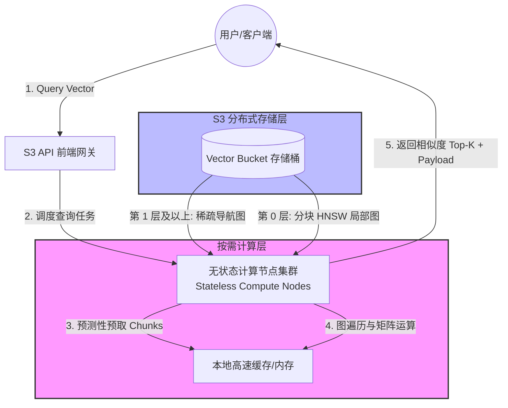
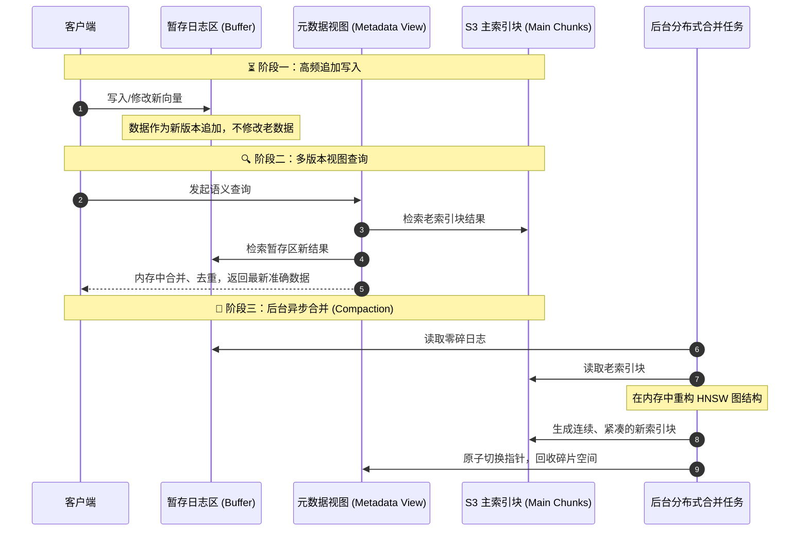

这里为你撰写了一篇关于 **Amazon S3 Vectors** 底层架构深度剖析的技术博客。文章采用了详细、硬核的风格，使用 Markdown 格式，并结合了 Mermaid 架构图来帮助读者直观理解其设计神髓。

---

# 🚀 告别昂贵内存！Amazon S3 Vectors 底层分布式架构与实现机制深度剖析

在生成式 AI 与大语言模型（LLM）万物互联的时代，**向量检索（Vector Search）** 已然成为 RAG（检索增强生成）和 AI Agent 长期记忆的底层基础设施。然而，传统向量数据库（如 Pinecone、Milvus）为了追求极速响应，通常要求索引与向量数据**常驻内存（RAM）**。面对数亿甚至数十亿级别的海量高维向量，这种“内存驻留”架构带来的服务器成本让众多企业望而却步。

AWS 推出的 **Amazon S3 Vectors** 彻底打破了这一僵局。作为全球首款原生支持向量存储与查询的云对象存储服务，它宣称能将综合成本**降低多达 90%**。

它是如何在廉价的 S3 磁盘存储上实现高性能向量检索的？其底层又隐藏着怎样的架构折中（Trade-offs）？本文将为你深度拆解。

---

## 🏗️ 核心架构：解耦存储与计算 (Decoupled Storage & Compute)

传统向量数据库是“存算一体”的，而 S3 Vectors 则是典型的**存算分离**架构。它将昂贵的内存消耗转化为按需流式计算，其核心组件互动的拓扑结构如下：

### 1. 持久化存储层（S3 Vector Bucket）

所有的原始高维向量、改版的 HNSW 索引文件，全部以分块（Chunks）的形式持久化在标准的 S3 磁盘介质上。用户只需支付低廉的存储单价，彻底告别昂贵的内存闲置成本。

### 2. 按需计算层（无状态计算节点）

当用户发起向量查询请求时，S3 后端会动态调度弹性的、无状态的计算节点（Stateless Compute Nodes）。这些节点通过 AWS 内部极高带宽的网络，**按需（On-Demand）** 将部分索引文件加载到临时内存中执行搜索，计算完毕后立即释放。

---

## 🔍 核心突破：如何攻克磁盘 I/O 延迟？

在磁盘上运行图检索算法，最大的灾难在于**随机 I/O 延迟**。HNSW（分层导航小世界图）算法在检索时，需要像“贪吃蛇”一样在图的节点之间不断跳跃（Graph Traversal）。如果每次跳跃都引发一次磁盘随机读取（耗时数毫秒），几十次跳跃就会导致延迟飙升至数百毫秒。

为了将延迟压低至几十毫秒级别，AWS 实现了两项核心技术创新：

### 📈 1. 紧凑的“块状化”图组织 (Chunked Graph Layout)

S3 Vectors 改变了 HNSW 节点的存储方式。它利用空间聚类算法，将空间几何位置临近的向量节点以及它们之间的邻居边信息，打包压缩在同一个固定大小的数据块（Data Chunk）中。

* **效果**：当检索算法在局部节点间跳跃时，高概率是在同一个 Data Chunk 内部进行。这就成功将大量的**随机 I/O 转化为了单次块读取**。

### 🏎️ 2. 预测性异步预取 (Predictive Asynchronous Prefetching)

这是 S3 Vectors 实现低延迟的精髓所在。计算节点在当前数据块中进行图遍历时，底层的预测算法会根据当前探索的方向、步长以及拓扑结构，**提前预测**出下一步可能跨越到哪几个外部磁盘块。

* **效果**：计算节点会提前向 S3 存储层发起并发的异步读取请求（Prefetch）。当算法真正需要跳跃到下一个外部块时，该块的数据往往已经静静地躺在计算节点的本地缓存中了。

### 🏛️ 3. 混合分流存储战略

HNSW 算法的结构是“上层节点稀疏，下层节点密集”。最上层是导航的主干道，节点极少；第 0 层则包含了 100% 的海量向量数据。
S3 Vectors 采用了聪明的**分级存储**：

* **导航层（第 1 层及以上）**：数据量极小，直接常驻在计算节点的高速缓存或 SSD 中，确保全局导航阶段零磁盘 I/O。
* **数据层（第 0 层）**：99% 的海量数据分块存放在 S3 磁盘中，配合异步预取进行精准定位。

---

## 🔄 写入机制：写时复制（Copy on Write）与碎片治理

为了在廉价存储上实现数据的快速写入与更新，S3 Vectors 在底层引入了类似于 LSM-Tree 或虚拟文件系统的 **Copy on Write（写时复制）** 机制。

### 1. 追加写与多版本视图

当用户新增、修改或删除向量时，S3 **绝对不会**去原地修改已经分块好、构建完毕的 S3 主索引块（因为代价太高）。所有变更都会被当作新数据，追加写入到一个暂存的日志区（Journaling Log / Buffer）中。

系统内部的元数据管理器会维护一个**多版本视图（Versioned Views）**。当用户发起查询时，计算节点会执行“双路并行查找”：同时检索 S3 主索引块和暂存日志区，并在内存中进行结果的实时合并、去重与版本对齐。

### 2. 空间碎片化与后台合并（Compaction）

随着追加写入的增多，暂存区会变得越来越臃肿，查询时的内存合并开销也会增大（导致延迟上升）。

为了维持健康的读性能，S3 Vectors 会在后台自动触发**异步合并（Compaction）**：

* 后台分布式任务会定期读取碎片化的日志和老索引块。
* 在内存中重新运行 HNSW 算法，将散落的节点重新聚类，生成连续、紧凑的新索引块。
* 完成后，原子性地切换元数据视图指针，并安全回收老旧的碎片空间。

---

## ⚖️ 架构师视角：S3 Vectors 的完美折中（Trade-offs）

天下没有免费的午餐，S3 Vectors 的超低成本和超高扩展性，是通过对某些性能指标进行精确的工程折中换来的：

| 评估维度 | 传统内存向量数据库 (如 Pinecone) | Amazon S3 Vectors |
| --- | --- | --- |
| **数据驻留介质** | 🚀 绝大部分常驻内存 (RAM) | 💾 持久化在磁盘 (S3 块存储) |
| **典型查询延迟** | ⚡ 极低 (**2 - 5 毫秒**级) | ⏱️ 中等 (**15 - 50 毫秒**级) |
| **大规模扩展成本** | 💰 非常昂贵 (成本随数据量线性暴涨) | 📉 极低 (最高可削减 **90%** 的总成本) |
| **最佳适用场景** | 📈 高频实时推荐、低延迟高并发风控系统 | 📦 **海量数据 RAG 知识库、多媒体语义搜索** |
| **数据一致性表现** | 🔄 强实时一致性 (写入即可极速查) | ⏳ 最终一致性 (依赖后台合并保证长期读性能) |

### 🛠️ 总结与选型建议

1. **看延迟**：如果你的 AI 应用（如在线高频推荐）对个位数毫秒级响应有硬性死命令，请继续坚守传统内存向量数据库。
2. **看规模与预算**：如果你的数据量达到了数亿甚至数十亿级别（TB/PB 级），且主要用于企业内部知识库、离线语义检索或对几十毫秒延迟不敏感的 RAG 系统，**Amazon S3 Vectors 无疑是当前最具性价比的破局利器**。它不仅帮你砍掉了 90% 的服务器账单，更把复杂的基础设施运维彻底变成了轻松的“免维护”托管体验。
